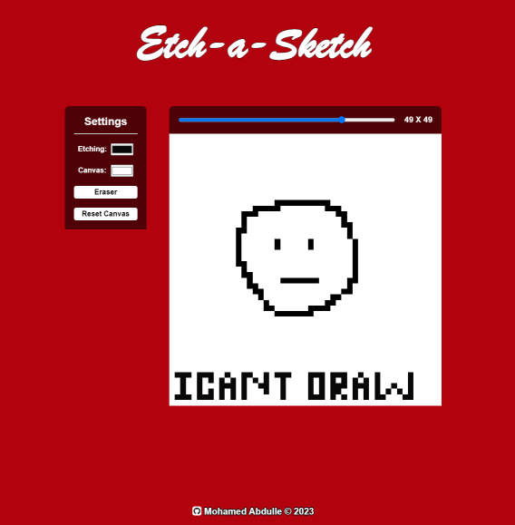
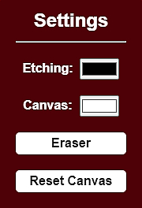
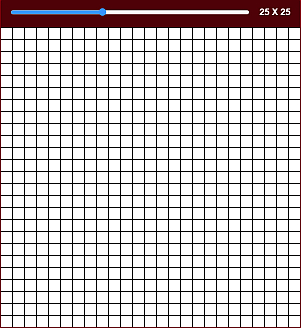

# Etch-a-Sketch
Etch-a-sketch is a tool that will allow you to sketch on a canvas.  
 

  

## Links
- [Click here to see the Etch-a-Sketch tool](https://mohamedabdulle.github.io/etch-a-sketch/)

- [Link to the assignment details](https://www.theodinproject.com/lessons/foundations-etch-a-sketch)

## Description

To start sketching, move your cursor over the canvas and click and drag.

<h3>The sketching tool comes with some settings to enhance the sketching experience:</h3>    

* Etching - Color of line when sketching. Clicking the button will automatically change the color to it as well.
* Canvas - Color of canvas.
* Eraser - The eraser color always matches the color of the canvas.
* Reset Canvas - Resets the canvas grid count.

 
 

<h3>The sketching tool comes with some settings to enhance the sketching experience:</h3>    

* Dragging the blue slider will adjust the canvas grid count.
* The black grid border will only show when dragging the slider. It gives a preview of the grid layout.
* In the image to the left, the slider count show 25 x 25. 
* This means that there are 25 grids horizontally and 25 grids vertically.

